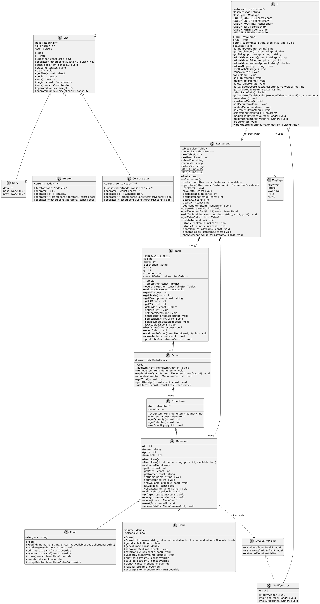

# Dokumentáció: 2. Részfeladat (Tervezés)
**Készítette:** Pallang Hunor  
**Tárgy:** Programozás alapjai 2.  
**Feladat:** BME Étterem Kezelő (Nagy házi feladat)

---
## 1. Pontosított feladatspecifikáció

### 1.1. A feladat általános leírása
A jelen **nagy házi feladat** célja egy étterem napi működését támogató digitális adminisztrációs rendszer kidolgozása konzolos felületen. A szoftver lehetővé teszi az étterem asztalainak, az étlap különböző típusú tételeinek és a vendégek rendeléseinek nyilvántartását. A program nem korlátozza a tárolható adatok mennyiségét, azokat a rendelkezésre álló memória erejéig dinamikusan kezeli.

### 1.2. Funkciók és elvárt működés (Felhasználói esetek)

#### 1.2.1. Asztalkezelés
* **Felvétel**: A felhasználó rögzíthet új asztalt a férőhelyek számának (minimum 2), egy rövid szöveges leírásnak, valamint az étterem alaprajzán elfoglalt X és Y koordinátáknak a megadásával.
* **Módosítás**: Lehetőség van a férőhelyek, a leírás és a pozíció utólagos korrekciójára.
* **Törlés**: Egy asztal eltávolítható a rendszerből, feltéve, hogy nem foglalt és nem tartozik hozzá aktív rendelés.
* **Asztal lezárása (Számlázás)**: A fogyasztás végén a program összesíti az asztalhoz tartozó rendeléseket, kiírja a fizetendő végösszeget a képernyőre, és egy formázott számlát generál külső szöveges fájlba. Ezt követően az asztal automatikusan felszabadul.

#### 1.2.2. Étlap (Menü) kezelése
A program két különböző típusú fogyasztási cikket tud nyilvántartani, eltérő tulajdonságokkal:
* **Ételek**: Név, egységár, elérhetőség (készleten van-e) és allergén információk.
* **Italok**: Név, egységár, elérhetőség, űrtartalom (pl. 0.5l) és alkoholtartalom jelzése.

A felhasználó ezeket a tételeket felveheti, adataikat módosíthatja, törölheti, illetve az egész étlapot kilistázhatja, ahol a program a típusnak megfelelő extra adatokat is megjeleníti.

#### 1.2.3. Rendelések menedzselése
* **Felvétel**: Egy kiválasztott asztalhoz tételek rendelhetők az étlapról, darabszám megadásával. Ha az asztal korábban szabad volt, a státusza automatikusan "foglalt"-ra változik.
* **Módosítás**: A már felvett rendelések darabszáma módosítható. Ha egy tétel mennyisége 0-ra csökken, az adott elem kikerül a rendelésből.
* **Lekérdezés**: Asztalonként megtekinthető az eddigi fogyasztás részletes listája és a pillanatnyi részösszeg.

#### 1.2.4. Foglaltsági térkép
A program karakteres vizuális felületen megjeleníti az étterem alaprajzát az asztalok koordinátái alapján. A térkép jelzi az asztalok azonosítóját és azok aktuális foglaltsági állapotát.

### 1.3. Bemenetek és kimenetek (Adatkezelés)
A program a futások közötti állapotmegőrzést egyszerű szöveges fájlok segítségével biztosítja. Induláskor beolvassa, kilépéskor felülírja őket. 

**Bemeneti és kimeneti adatfájlok formátuma:**
* **asztalok.txt**: ID;férőhely;leírás;X;Y;foglaltság
* **etelek.txt**: Típus(E/I);ID;név;ár;elérhetőség;[Extra: allergén VAGY űrtartalom;alkoholos]
* **orders.txt**: RendelésID;AsztalID;Végösszeg;TételekSzáma;[ÉtelID;Mennyiség]...

**Generált kimenet:**
* **Számlák**: Az asztal lezárásakor a szamlak/ mappába kerülnek generálásra szamla_YYYYMMDD_ID.txt néven. A fájl formázottan, ember számára olvashatóan tartalmazza az étterem adatait, a dátumot, a tételek listáját részösszegekkel, és a végösszeget.

### 1.4. Működési peremfeltételek és körülmények
* **Interaktivitás és Batch mód**: A program alapértelmezetten interaktív konzolos menürendszerrel kommunikál a standard bemeneten (stdin) és kimeneten (stdout). A menüvezérlés azonban kialakításából fakadóan támogatja a fájlból történő bemenet-átirányítást, így automatizált tesztfájlokkal is működtethető.
* **Bemenet-validálás**: A rendszer ellenőrzi a felhasználói adatokat. Rossz adattípus (pl. szám helyett betű) vagy érvénytelen logikai érték (pl. negatív ár, pályán kívüli koordináta) esetén a program nem omlik össze, hanem hibaüzenetet ad és újrakéri az adatot.
* **Ütközésvédelem**: Két asztal térben nem fedheti egymást, ugyanazokra az X-Y koordinátákra asztal nem rögzíthető.
* **Adatintegritás**: Ha a program indításakor a bemeneti adatfájlok nem léteznek, a program hiba nélkül, üres adatbázissal indul, és azokat a futás végén hozza létre.

---

## 2. Rendszerterv: Osztálydiagram (UML)

---

## 3. Osztályok és kapcsolatok szöveges bemutatása

A szoftver architektúrája az objektumorientált tervezési elveket (egységbezárás, adatrejtés, felelősségek szétválasztása) követi, szem előtt tartva a hatékony memóriakezelést és a polimorfizmus adta lehetőségeket.

### 3.1. Generikus Adatszerkezet (STL mentesség)
* **List<T>**: Egy saját fejlesztésű, sablon (template) alapú, duplán láncolt lista, amely az adatok dinamikus tárolásáért felel. A tiltott STL tárolók helyettesítésére szolgál.
* **Node<T>**: A lista belső építőeleme, amely az adatot és a láncoláshoz szükséges mutatókat tárolja. A külvilág számára rejtett (private).
* **Iterator**: A lista bejárását biztosító belső osztály. Túlterheli az operator++, operator* és operator!= operátorokat, így lehetővé teszi a lista elemeinek hatékony, C++11 stílusú tartományalapú for-ciklusok használatát.
* **Memóriakezelés**: A List osztály implementálja a "Hármas Szabályt" (destruktor, másoló konstruktor, értékadó operátor), így biztosítva a mély másolást (deep copy) és a memóriaszivárgásmentes működést.

### 3.2. Étlap hierarchia (Polimorfizmus)
* **MenuItem (Absztrakt ősosztály)**: Meghatározza a fogyasztási cikkek közös interfészét (ID, név, ár). Tisztán virtuális függvényeket tartalmaz a megjelenítésre (print) és mentésre (save). A virtuális destruktor garantálja a leszármazottak helyes felszabadítását, a virtuális clone() metódus pedig a prototípus minta alapján teszi lehetővé a polimorf objektumok másolását.
* **Food és Drink**: Konkrét leszármazottak, amelyek egyedi attribútumokkal (allergének, illetve űrtartalom és alkoholtartalom) egészítik ki az ősosztályt, és megvalósítják a rájuk jellemző speciális logikát.

### 3.3. Rendeléskezelés (Kompozíció)
* **OrderItem**: Egy konkrét rendelési tételt reprezentál. Nem ID-t, hanem közvetlen mutatót (MenuItem*) tárol az étlap egy elemére, ami lehetővé teszi a részösszegek azonnali kiszámítását anélkül, hogy minden lépésben keresni kellene az étlapon.
* **Order**: Egy asztalhoz tartozó rendelést fog össze. Tartalmaz egy List<OrderItem> példányt a tételek tárolására. Felelős a végösszeg kiszámításáért és a számlázási formátum összeállításáért.
* **Table**: Az étterem asztalait reprezentálja. **Kompozíciós kapcsolatban** áll az Order osztállyal: a currentOrder mutatóján keresztül birtokolja az aktuális rendelést. Ha az asztal lezárul, a Table felel az Order objektum megsemmisítéséért. Az osztály szintén megvalósítja a Hármas Szabályt a dinamikusan kezelt rendelés-objektum miatt.

### 3.4. Rendszervezérlés (Menedzser minta)
* **Restaurant**: A program központi vezérlő osztálya (Facade minta). Tulajdonolja az asztalok és az étlap tételeinek listáját.
* **Felelősségi körök**: Kezeli a fájlból történő betöltést (loadData) és mentést (saveData). Mivel globális rálátása van a teljes rendszerre, ő végzi a biztonsági ellenőrzéseket is (pl. egy étel csak akkor törölhető az étlapról, ha egyetlen asztal aktív rendelésében sem szerepel).
* **Biztonság**: A Restaurant osztály másoló konstruktora és értékadó operátora tiltott, megakadályozva a teljes adatbázis véletlen és hibás duplikálását a memóriában.

## 4. Fontosabb algoritmusok

A program működése során kiemelt szerepet kap az adatok konzisztenciájának megőrzése és a dinamikus memóriaterületek biztonságos kezelése. Az alábbiakban a három legkritikusabb logikai folyamat leírása szerepel.

### 4.1. Adatok betöltése és a mutatók feloldása (Pointer Linking)
Mivel a fájlokban (orders.txt) csak azonosítók (ID-k) tárolhatók, a betöltés során a programnak össze kell kapcsolnia ezeket a memóriában már létező objektumokkal.

**Az algoritmus lépései:**
1. A Restaurant osztály először beolvassa a MenuItem (Food/Drink) objektumokat az étlap listájába, majd az összes asztalt a tables listába.
2. Az orders.txt feldolgozásakor a program beolvassa az asztal azonosítóját (tableID).
3. Egy kereső algoritmus végigfut a tables listán, és megkeresi a megfelelő Table objektumot az ID alapján.
4. Meghívja az asztal openOrder() metódusát, amely létrehoz egy új Order objektumot a heap memóriában.
5. A rendelés tételeinek beolvasásakor a program az étel ID-ja alapján megkeresi a megfelelő MenuItem* mutatót a központi étlap listában.
6. A kinyert memóriacímet és a mennyiséget átadja az asztalnak: table.addItemToOrder(menuItemPtr, quantity). Ezáltal a rendelés nem az adatokat másolja le, hanem közvetlenül az étlap elemeire hivatkozik.

### 4.2. Biztonságos törlés (Dangling Pointer elleni védelem)
Kritikus hiba lenne törölni egy ételt az étlapról, ha arra egy asztal aktuális rendelése még hivatkozik. Az algoritmus ezt a függőséget ellenőrzi.

**Az algoritmus lépései:**
1. A felhasználó kiválasztja a törlendő elemet. A Restaurant::deleteMenuItem megkapja a törlendő objektum mutatóját (itemToDelete).
2. A program egy iterátor segítségével végigiterál az étterem összes asztalán (tables lista).
3. Minden asztalnál ellenőrzi, hogy van-e aktív rendelése: if (table.hasActiveOrder()).
4. Ha az asztal foglalt, a program végigmegy az asztalhoz tartozó rendelés tételein.
5. Ha bármelyik OrderItem a törlendő memóriacímre (itemToDelete) mutat, a program egy hibaüzenettel (vagy kivétellel) megszakítja a folyamatot, jelezve, hogy az elem jelenleg használatban van.
6. Amennyiben egyetlen asztal sem hivatkozik az elemre, a program eltávolítja a mutatót az étlap listából, és felszabadítja a memóriát: delete itemToDelete.

### 4.3. Asztal lezárása és számlagenerálás (Delegáció)
Ez az algoritmus mutatja be, hogyan vándorol a felelősség az objektumhierarchiában a lezárási folyamat során.

**Az algoritmus lépései:**
1. A vezérlés megkeresi a lezárandó asztalt a Restaurant osztályban, majd meghívja annak closeTable() metódusát.
2. Az asztal objektum megnyitja a számlafájlt írásra, majd "megkéri" a saját rendelés objektumát a tartalom összeállítására: currentOrder->printReceipt(file).
3. Az Order objektum végigiterál a saját OrderItem listáján. Minden tételnél lekéri a hivatkozott étel nevét és árát a mutatókon keresztül, kiszámolja a részösszeget, és a fájlba írja.
4. Miután a számla elkészült, a Table osztály gondoskodik a memória felszabadításáról: meghívja a delete currentOrder parancsot (melynek destruktora kitakarítja a rendelési tételeket).
5. Végül az asztal mutatóját nullptr-re állítja és a foglaltsági jelzőt hamisra állítja.